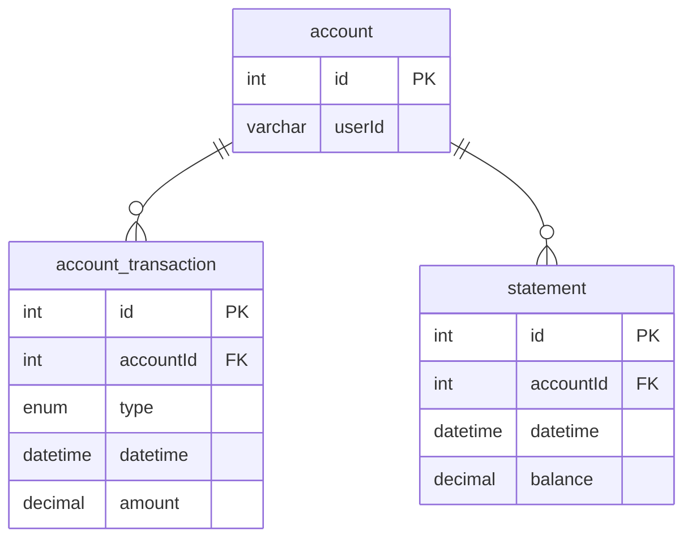

# Investment Coding Challenge

## Getting Started
1. Install [Node.js](https://nodejs.org/) and [Docker](https://docs.docker.com/compose/install/)
2. Run `npm install` to install dependencies
3. Run `docker compose up -d` to start MySQL instance
4. Update `DB_HOST` in `.env` file if needed
5. Run `npm start` to run test cases

## Database Design

### ERD



### DDL

```sql
CREATE TABLE `account` (
  `id` int NOT NULL AUTO_INCREMENT,
  `userId` varchar(36) NOT NULL,
  PRIMARY KEY (`id`)
) ENGINE=InnoDB DEFAULT CHARSET=utf8mb4 COLLATE=utf8mb4_0900_ai_ci;


CREATE TABLE `account_transaction` (
  `id` int NOT NULL AUTO_INCREMENT,
  `accountId` int NOT NULL,
  `datetime` datetime NOT NULL,
  `amount` decimal(13,4) NOT NULL,
  `type` enum('DEPOSIT','WITHDRAWAL') NOT NULL,
  PRIMARY KEY (`id`),
  KEY `FK_03114b894370038c6294a8a74b9` (`accountId`),
  CONSTRAINT `FK_03114b894370038c6294a8a74b9` FOREIGN KEY (`accountId`) REFERENCES `account` (`id`)
) ENGINE=InnoDB DEFAULT CHARSET=utf8mb4 COLLATE=utf8mb4_0900_ai_ci;


CREATE TABLE `statement` (
  `id` int NOT NULL AUTO_INCREMENT,
  `accountId` int NOT NULL,
  `datetime` datetime NOT NULL,
  `balance` decimal(13,4) NOT NULL,
  PRIMARY KEY (`id`),
  KEY `FK_38f9391b0bc74a9805bcbb7f362` (`accountId`),
  CONSTRAINT `FK_38f9391b0bc74a9805bcbb7f362` FOREIGN KEY (`accountId`) REFERENCES `account` (`id`)
) ENGINE=InnoDB DEFAULT CHARSET=utf8mb4 COLLATE=utf8mb4_0900_ai_ci;
```